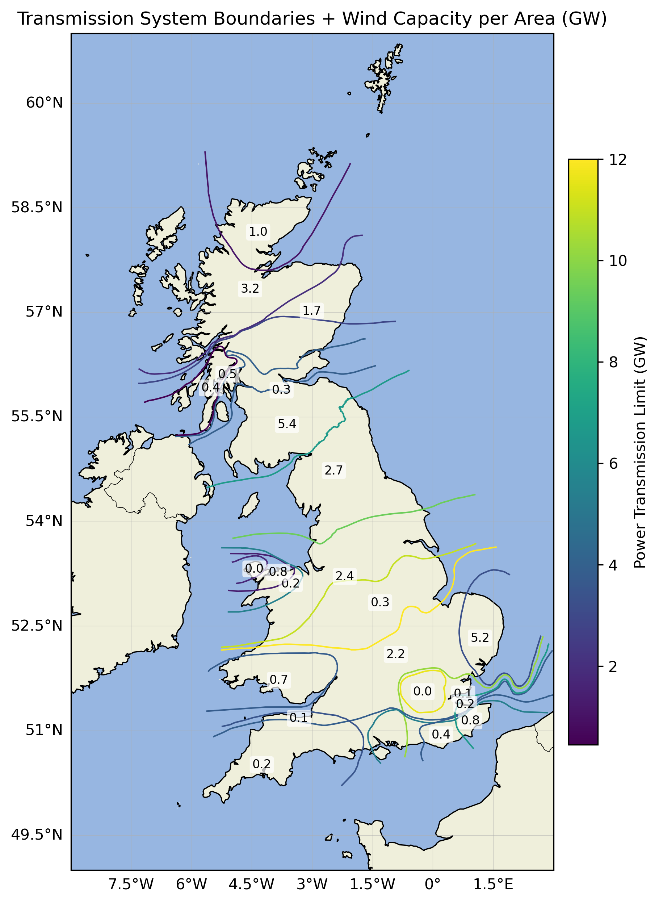
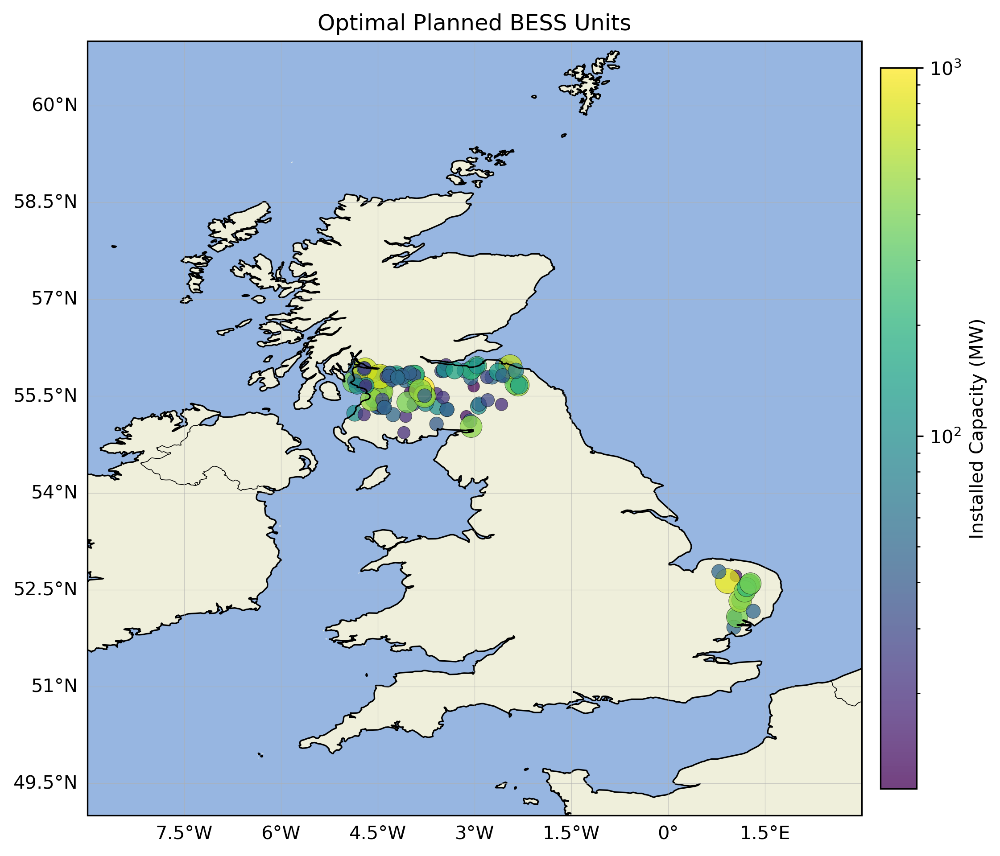

# Wind Energy Project

This project analyses the relationship between UK wind farm capacity and
electricity transmission infrastructure, to understand wind curtailment in Great Britain. It processes government wind farm data, matches offshore wind farms to substations, and constructs transmission boundary regions, in order to visualise capacity distributions on maps. Additionally it processes government battery energy storage substation data in order to find the areas where planned BESS projects would be most optimal to install, i.e. where they could best reinforce grid bottlenecks. 

## Example Output

Example map of transmission boundaries with wind power capacity per region

Example map of optmimum planned BESS projects

## Data Sources

- [UK Renewable Energy Planning Database (REPD)](https://www.gov.uk/government/publications/renewable-energy-planning-database-monthly-extract)
- [National Grid electricity transmission network data](https://www.neso.energy/data-portal/etys-gb-transmission-system-boundaries)
- [Natural Earth country boundaries](https://www.naturalearthdata.com/)

